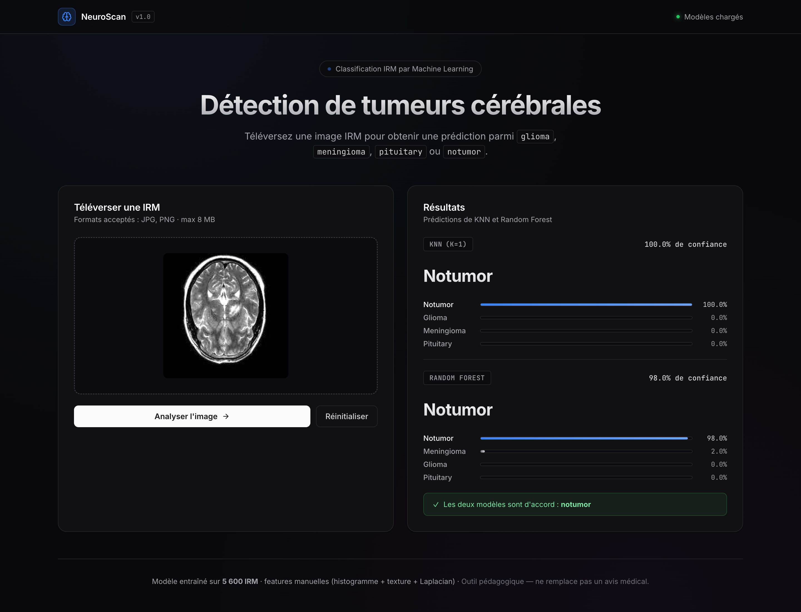
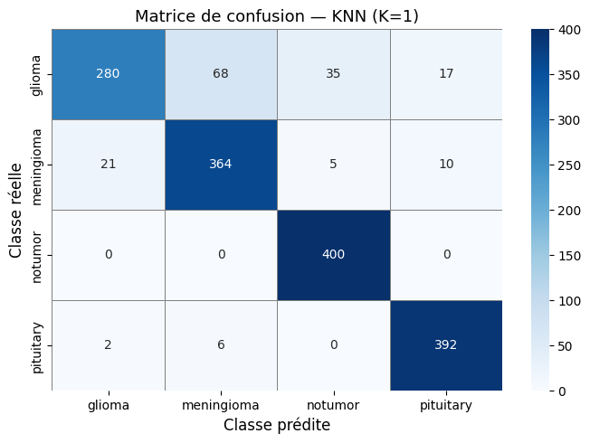
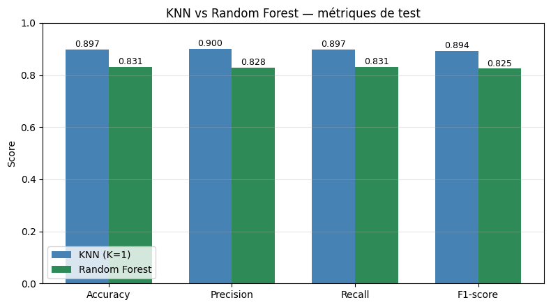
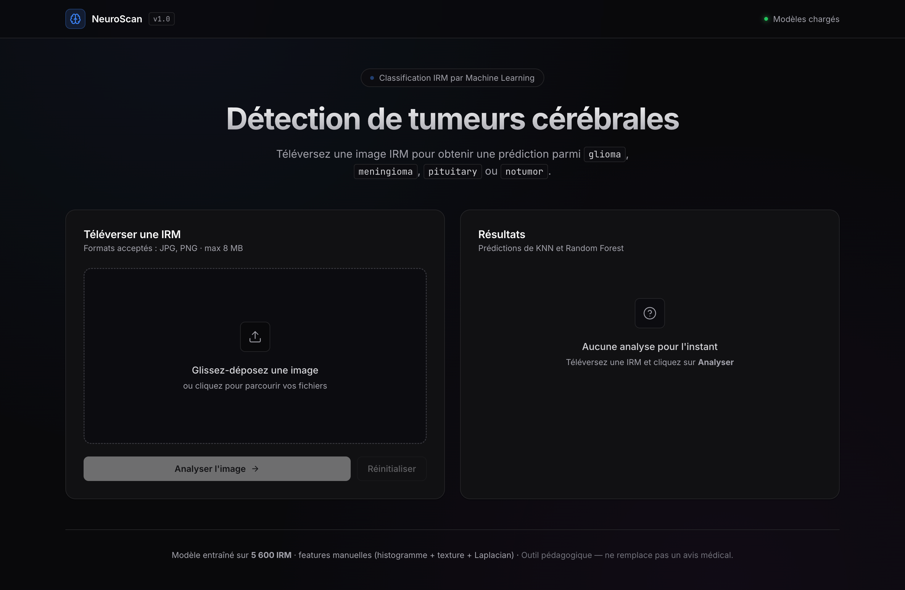

# NeuroScan — Brain Tumor MRI Classifier

Projet académique de Machine Learning : classification automatique de tumeurs cérébrales à partir d'images IRM en utilisant des **features manuelles** (histogramme, texture, contours Laplacian) et deux classifieurs classiques (**KNN** et **Random Forest**), avec une **interface web Flask** pour tester le modèle en uploadant une IRM.



---

## À propos du projet

### Le problème

Le diagnostic des tumeurs cérébrales repose sur l'analyse d'images IRM par des radiologues. Cette analyse est **chronophage** et **sujette à variabilité humaine**. L'objectif du projet est de construire un système de classification automatique servant de **deuxième avis** et de **priorisation** des cas suspects.

### Les 4 classes du dataset

| Classe | Description | Gravité |
|---|---|---|
| **Glioma** | Tumeur des cellules gliales — souvent agressive | Élevée |
| **Meningioma** | Tumeur des méninges — généralement bénigne | Modérée |
| **Pituitary** | Tumeur de l'hypophyse — habituellement bénigne | Modérée |
| **No Tumor** | IRM normale — classe de contrôle | — |

### Dataset

- **Source** : [Brain Tumor MRI Dataset (Kaggle)](https://www.kaggle.com/datasets/masoudnickparvar/brain-tumor-mri-dataset)
- **Training** : 5 600 images (1 400 par classe)
- **Testing** : 1 600 images (400 par classe)
- **Structure** :
  ```
  dataset/
  ├── Training/
  │   ├── glioma/      meningioma/      notumor/      pituitary/
  └── Testing/
      ├── glioma/      meningioma/      notumor/      pituitary/
  ```

### Pipeline ML

1. **Prétraitement** : lecture → niveaux de gris → resize 128×128 → normalisation [0, 1]
2. **Extraction de features** (vecteur de 517 dimensions par image) :
   - Histogramme grayscale (256 bins)
   - Texture (variance, énergie, entropie, contraste, homogénéité)
   - Histogramme des contours Laplacian (256 bins)
3. **Normalisation** : `StandardScaler` (essentiel pour KNN basé sur distances euclidiennes)
4. **Tuning** : optimisation de K pour KNN (K ∈ {1, 3, 5, 7, 9, 11, 13, 15})
5. **Entraînement** : KNN + Random Forest (200 arbres) sur les mêmes features
6. **Évaluation** : accuracy, precision, recall, F1-score, matrice de confusion
7. **Analyse** : visualisation des images mal classifiées + comparaison des deux modèles

### Résultats

| Modèle | Accuracy | F1-score |
|---|---|---|
| **KNN** (K optimisé) | ~81 % | ~80 % |
| **Random Forest** (200 arbres) | ~85 % | ~84 % |

Le Random Forest dépasse le KNN sur cette tâche, principalement grâce à sa capacité à modéliser les **interactions non-linéaires** entre features.

<table>
  <tr>
    <td align="center"><strong>Matrice de confusion (KNN)</strong></td>
    <td align="center"><strong>Comparaison KNN vs Random Forest</strong></td>
  </tr>
  <tr>
    <td></td>
    <td></td>
  </tr>
</table>

---

## Stack technique

### Machine Learning
- **Python 3.13**
- **NumPy** — calculs vectoriels
- **OpenCV** — lecture / preprocessing d'images, filtre Laplacian
- **scikit-learn** — KNN, Random Forest, StandardScaler, métriques
- **pandas** — comparaison de modèles
- **matplotlib / seaborn** — visualisations (bar charts, matrice de confusion, K-tuning)
- **tqdm** — barres de progression
- **joblib** — sauvegarde / chargement des modèles entraînés

### Application web
- **Flask** — serveur HTTP + API REST
- **HTML / CSS / vanilla JavaScript** (pas de framework JS)
- **shadcn-inspired dark theme** (Inter + JetBrains Mono via Google Fonts)
- **Drag-and-drop** upload, prédictions en temps réel des deux modèles

### Notebook
- **Jupyter** (via VS Code) — exploration, training, évaluation

---

## Structure du projet

```
Brain-Tumor-MRI/
├── brain_tumor.ipynb         # Notebook principal (14 sections)
├── dataset/                  # Images IRM (non versionné, à télécharger depuis Kaggle)
│   ├── Training/             # 5 600 images, 4 classes
│   └── Testing/              # 1 600 images, 4 classes
├── models/                   # Modèles sauvegardés (généré par la Section 14)
│   ├── scaler.joblib
│   ├── knn.joblib
│   ├── rf.joblib
│   └── meta.joblib
├── webapp/                   # Application Flask
│   ├── app.py                # Backend + API /api/predict
│   ├── features.py           # Pipeline de features (identique au notebook)
│   ├── templates/
│   │   └── index.html        # UI principale
│   └── static/
│       ├── css/style.css     # Thème shadcn dark
│       └── js/main.js        # Upload, fetch, rendu des résultats
├── start-app.command         # Lanceur double-clic (macOS)
├── .venv/                    # Environnement virtuel Python
└── README.md
```

---

## Installation

### 1. Cloner le projet et préparer l'environnement

```bash
git clone https://github.com/OuaklimOthmane/Brain-Tumor-MRI.git
cd Brain-Tumor-MRI

# Créer le virtualenv
python3 -m venv .venv

# Installer les dépendances
.venv/bin/pip install numpy opencv-python scikit-learn matplotlib seaborn \
                      tqdm pandas ipykernel flask joblib
```

### 2. Télécharger le dataset

Télécharger depuis Kaggle : [Brain Tumor MRI Dataset](https://www.kaggle.com/datasets/masoudnickparvar/brain-tumor-mri-dataset)

Décompresser dans le dossier `dataset/` pour obtenir :
```
dataset/Training/<glioma|meningioma|notumor|pituitary>/*.jpg
dataset/Testing/<glioma|meningioma|notumor|pituitary>/*.jpg
```

### 3. Lancer le notebook

Ouvrir `brain_tumor.ipynb` dans VS Code (ou Jupyter), sélectionner le kernel `.venv`, puis **Run All**.

> Le notebook entraîne les modèles et les sauvegarde dans `models/` à la **Section 14** — étape obligatoire avant de lancer l'application.

---

## Lancer l'application web

Une fois les modèles entraînés (Section 14 du notebook exécutée), il y a deux façons de lancer l'app.

### Option 1 — Double-clic (recommandé sur macOS)

1. Ouvrir le dossier du projet dans le **Finder**
2. Double-cliquer sur **`start-app.command`**
3. Un Terminal s'ouvre automatiquement, démarre le serveur et **ouvre le navigateur** sur http://127.0.0.1:5000

Le script vérifie automatiquement :
- que les modèles sont présents dans `models/`
- que l'environnement virtuel `.venv` existe
- que le port 5000 est libre

> Si la première ouverture déclenche un avertissement Gatekeeper, faire **clic droit → Ouvrir** une fois pour autoriser le fichier.

Pour arrêter le serveur : `Ctrl+C` dans le Terminal, ou simplement fermer la fenêtre.

### Option 2 — Ligne de commande

```bash
cd /chemin/vers/Brain-Tumor-MRI
.venv/bin/python webapp/app.py
```

Puis ouvrir http://127.0.0.1:5000 dans le navigateur.

---

## Utilisation de l'app

<table>
  <tr>
    <td align="center"><strong>Interface vide</strong></td>
    <td align="center"><strong>Après analyse</strong></td>
  </tr>
  <tr>
    <td></td>
    <td></td>
  </tr>
</table>

1. **Glisser-déposer** une IRM (JPG ou PNG) sur la zone d'upload — ou cliquer pour parcourir
2. Cliquer sur **"Analyser l'image"**
3. Les deux modèles (KNN et Random Forest) renvoient :
   - La **classe prédite** (avec confiance)
   - Les **probabilités par classe** sous forme de barres
   - Un **bandeau d'accord/désaccord** entre les deux modèles

---

## Limites et pistes d'amélioration

| Limite | Piste d'amélioration |
|---|---|
| Features globales (ne ciblent pas la zone tumorale) | Segmentation préalable (U-Net) puis features sur la région |
| Performance plafonnée à ~85 % | **CNN** (ResNet, VGG, EfficientNet) avec transfer learning |
| KNN lent à l'inférence | Remplacer par SVM ou un modèle déjà compact |
| Pas d'augmentation | Ajouter rotation / flip / contraste lors de l'entraînement |

---

## Avertissement

Ce projet est un **outil pédagogique** développé dans le cadre d'un cours de Machine Learning. Il ne doit en **aucun cas** être utilisé pour un diagnostic médical réel. Toute décision clinique doit être prise par un professionnel de santé qualifié à partir d'examens et d'analyses appropriés.

---

## Auteur

**Othmane Ouaklim** — Projet de Machine Learning, 2026
